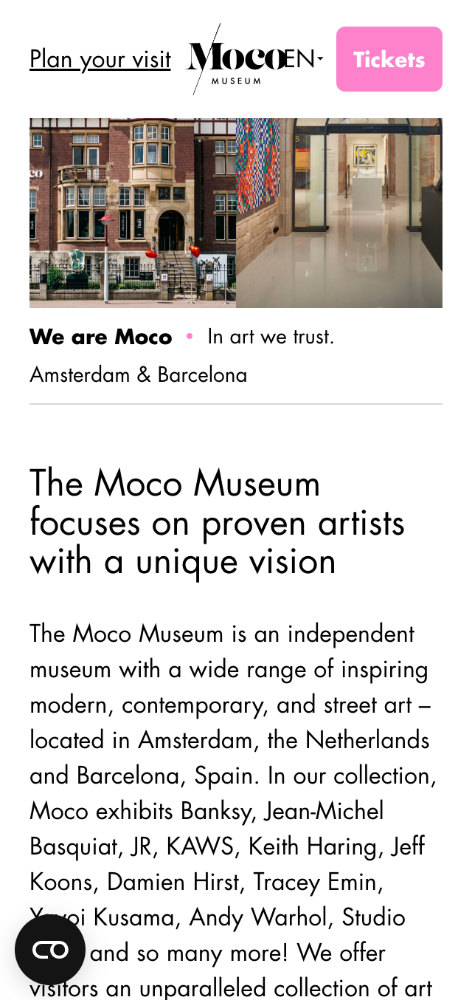

# Procesverslag
Markdown is een simpele manier om HTML te schrijven.  
Markdown cheat cheet: [Hulp bij het schrijven van Markdown](https://github.com/adam-p/markdown-here/wiki/Markdown-Cheatsheet).

Nb. De standaardstructuur en de spartaanse opmaak van de README.md zijn helemaal prima. Het gaat om de inhoud van je procesverslag. Besteedt de tijd voor pracht en praal aan je website.

Nb. Door *open* toe te voegen aan een *details* element kun je deze standaard open zetten. Fijn om dat steeds voor de relevante stuk(ken) te doen.

## Jij

  
uitwerken voor kick-off werkgroep

  ### Auteur:
  Deniz Akgür

  #### Je startniveau:
  Blauw

  #### Je focus:
  Surface plane
 

## Je website

  
uitwerken voor kick-off werkgroep

  ### Je opdracht:
  https://mocomuseum.com/

  #### Screenshot(s) van de eerste pagina (small screen): 
  Home pagina Moco 
  

  #### Screenshot(s) van de tweede pagina (small screen):
  About Moco pagina 
  
 

## Toegankelijkheidstest 1/2 (week 1)

  
uitwerken na test in 1e werkgroep

  ### Bevindingen
  Lijst met je bevindingen die in de test naar voren kwamen:

  #### Screenreader
  Hier korte omschrijving (met indien nodig afbeeldingen)

  Hier een omschrijving van hoe het opgelost kan worden (met indien nodig afbeeldingen)

  #### Muis en Toetsenbord 
  Hier korte omschrijving (met indien nodig afbeeldingen)

  Hier een omschrijving van hoe het opgelost kan worden (met indien nodig afbeeldingen)

  #### Motoriek (shocks, elastiekjes)
  Hier korte omschrijving (met indien nodig afbeeldingen)

  Hier een omschrijving van hoe het opgelost kan worden (met indien nodig afbeeldingen)

  #### Visueel (brillen, contrast, kleurenblind, dark/light). 
  Hier korte omschrijving (met indien nodig afbeeldingen)

  Hier een omschrijving van hoe het opgelost kan worden (met indien nodig afbeeldingen)

## Breakdownschets (week 1)

  
uitwerken na afloop 2e werkgroep

  ### de hele pagina: 
  

  ### dynamisch deel (bijv menu): 
  

  ### wellicht nog een dynamisch deel (bijv filter): 
  

## Voortgang 1 (week 2)

  
uitwerken voor 1e voortgang

  ### Stand van zaken
  hier dit ging goed & dit was lastig (neem ook screenshots op van delen van je website en code)
Dit ging goed:
 Het maken van de root in css.
  
  Dit was lastig:

 Ik had veel moeite met mijn header, had het eerst goed maar bij About Moco pagina moet het anders en toen ging het fout.
  

  ### Agenda voor meeting
  samen met je groepje opstellen
  
  | Deniz                                                           | Michelle                                                        | Quinesha     | Mike             |
  | ---                                                                                                                                 | ---                | ---          | ---              |
  | Vraag. Bij me footer hoe zet ik de teks                         | Vraag. Hoe maak ik een uitklapbaar menu?                          | Vraag.Hoe zet ik de pijltjes van mij carousel aan de zijkanten.    | Vraag. Hoe maak ik een responsive menu?    |
  | Vraag. Hoe maak ik de Amsterdam/Barcelona button?               | Vraag. Hoe maak je een slideshow van tekst?| Vraag. Hoe zet ik een carousel naast een list? | 
  | Vraag. Hoe maak ik de header en main bij mijn About Moco page?  | Vraag.Hoe zorg ik ervoor min. 2 en max. 4 items op een rij krijg?               |Vraag. Waarom krijg een witte balk wanneer ik naar een kleine scherm ga?         |               |

  ### Verslag van meeting
  hier na afloop snel de uitkomsten van de meeting vastleggen

  - punt 1
  - punt 2
  - nog een punt
  - ...

## Voortgang 2 (week 3)

  
uitwerken voor 2e voortgang

  ### Stand van zaken
  hier dit ging goed & dit was lastig (neem ook screenshots op van delen van je website en code)

Dit was lastig:

  ### Agenda voor meeting
  samen met je groepje opstellen

  | Deniz     | Donna          | Mohini    | Shanine        |
  | ---            | ---                | ---          | ---            
  | Vraag. Hoe zet ik een background image bij mijn header?  | Vraag. Mag je een ID gebruiken zodat je maar 1 css pagina hebt?             | Vraag. Hoe style ik forms?   | Vraag. Hoe maak ik de cirkel bovenin?    |             | 
  | Vraag. Hoe zet ik content in een bepaalde volgorde? | Vraag. Mag ik deze ID houden? | Vraag. Hoe voeg je een countdown timer? | Vraag. Hoe zet je een filmpje bij de header? |
  | Vraag. Hoe zet ik mijn buttons naast  elkaar met een img  ertussen?           | Vraag. Hoe doe ik deze transitions?             | Vraag. Waarom werkt me AddEventListener niet?         |               |
  | Vraag. Waarom werkt me font niet?            | Vraag. Mogen px bij media schermbreedte?             |           |               |
 
  | Arron      | 
  | ---            | 
  | Vraag. Hoe doe je transitions?  |
  |  | 
  |             |

  ### Verslag van meeting
  hier na afloop snel de uitkomsten van de meeting vastleggen

  - punt 1
  - punt 2
  - nog een punt
- ...

## Toegankelijkheidstest 2/2 (week 4)

  
uitwerken na test in 8e werkgroep

  ### Bevindingen
  Lijst met je bevindingen die in de test naar voren kwamen (geef ook aan wat er verbeterd is):

  #### Screenreader
  Hier korte omschrijving (met indien nodig afbeeldingen)

  Hier een omschrijving van hoe het opgelost kan worden (met indien nodig afbeeldingen)

  #### Muis en Toetsenbord 
  Hier korte omschrijving (met indien nodig afbeeldingen)

  Hier een omschrijving van hoe het opgelost kan worden (met indien nodig afbeeldingen)

  #### Motoriek (shocks, elastiekjes)
  Hier korte omschrijving (met indien nodig afbeeldingen)

  Hier een omschrijving van hoe het opgelost kan worden (met indien nodig afbeeldingen)

  #### Visueel (brillen, contrast, kleurenblind, dark/light). 
  Hier korte omschrijving (met indien nodig afbeeldingen)

  Hier een omschrijving van hoe het opgelost kan worden (met indien nodig afbeeldingen)

## Voortgang 3 (week 4)

  
uitwerken voor 3e voortgang

  ### Stand van zaken
  hier dit ging goed & dit was lastig (neem ook screenshots op van delen van je website en code)

  ### Agenda voor meeting
  samen met je groepje opstellen

  | student 1      | student 2          | student 3    | student 4        |
  | ---            | ---                | ---          | ---              |
  | dit bespreken  | en dit             | en ik dit    | en dan ik dat    |
  | en dat ook nog | dit als er tijd is | nog een punt | dit wil ik zeker |
  | ...            | ...                | ...          | ...              |

  ### Verslag van meeting
  hier na afloop snel de uitkomsten van de meeting vastleggen

  - punt 1
  - punt 2
  - nog een punt
  - ...

## Eindgesprek (week 5)

  
uitwerken voor eindgesprek

  ### Je uitkomst - karakteristiek screenshots:
  

  ### Dit ging goed/Heb ik geleerd: 
  Korte omschrijving met plaatjes

  

  ### Dit was lastig/Is niet gelukt:
  Korte omschrijving met plaatjes

  

## Bronnenlijst

  
continu bijhouden terwijl je werkt

  Nb. Wees specifiek ('css-tricks' als bron is bijv. niet specifiek genoeg).

  1. bron 1
  2. bron 2
  3. ...

